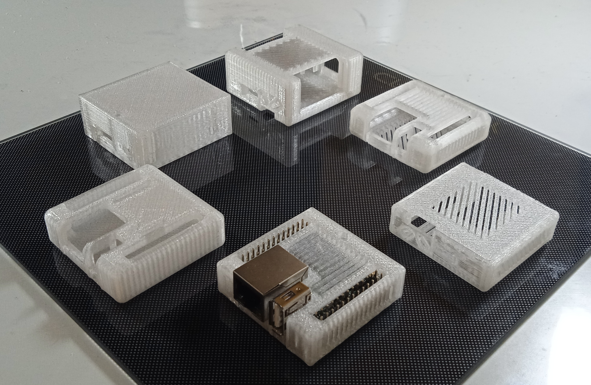

If the joint between case lids is too loose/tight try increasing/decreasing 'snap joints per side' and 'snap joint radius' parameters in OpenSCAD customizer.
The default values provide a fairly tight coupling between the lids when printed with PETG and a layer height of 0.2 mm.
